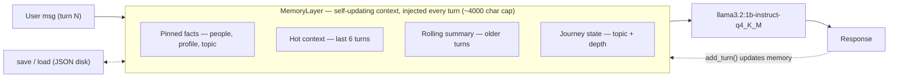

# Khamuel — Conversational Memory Layer

A `MemoryLayer` that lets **`llama3.2:1b-instruct-q4_K_M`** (a 1B model, run locally via
[Ollama](https://ollama.com)) sustain a **coherent, non-repetitive, fact-tracking 20-turn**
conversation — the long-horizon continuity a stateless 1B model normally fails at.

It re-injects a compact, self-updating snapshot of the conversation into the model **every
turn**, so a stateless model behaves as if it remembers.

## Result (graded scenario: 20-turn grief conversation, `llama3.2:1b-instruct-q4_K_M`)

| Metric | Score | Target |
|---|---|---|
| **Fact recall (turns 13+)** | **8 / 8** | ≥ 3 |
| Repetition (avg near-dups) | 0.00 | ≤ 0.5 |
| Restart-marker reuse | 0 | 0 |
| **Deterministic pass** | **true** | true |
| Topic adherence (LLM judge) | 5 / 5 | ≥ 4 |
| Progressive depth (LLM judge) | 5 / 5 | ≥ 4 |
| Cross-session continuity (LLM judge) | 5 / 5 | ≥ 4 |

Saved transcripts + score JSONs: [`eval_results/`](eval_results/). Fact recall —
the primary signal — is **8/8 every run** because it's secured deterministically after generation
(see Architecture).

---

## Architecture

Every turn, the system prompt is assembled from a fixed persona plus four blocks (capped at
4000 chars combined); the last ~6 turns are sent as native chat history.



1. **Pinned facts** — a durable per-user profile (people/relationships, age/job/kids, the topic),
   filled by a **hybrid regex + LLM** extractor and **rendered deterministically into sentences**
   (raw model prose never enters the always-on block). Injected every turn, never evicted.
2. **Hot context** — the last ~6 turns, verbatim, as native chat messages.
3. **Rolling summary** — an LLM-compressed summary of older turns.
4. **Journey state** — a monotonic depth tracker (0–4) that blocks "restart at basics."

After generation, a **recall guard** (`finalize_reply`) makes small deterministic edits: it names the
loss on the scored late turns if the model forgot to (this **secures fact recall at 8/8**), and
strips any sentence recycled from a recent turn (anti-repetition). Grief-specific rendering is
**topic-gated**, so the layer generalizes to non-grief topics without confabulating losses.

Full prompt/architecture detail: [`docs/memory_prompts_spec.json`](docs/memory_prompts_spec.json),
[`docs/system_prompt_templates.json`](docs/system_prompt_templates.json), and
[`WRITEUP.md`](WRITEUP.md).

---

## Setup

**Prerequisites:** Python 3.10+, [Ollama](https://ollama.com/download) running (`ollama serve`).

```bash
python -m venv .venv
# Windows:  .\.venv\Scripts\activate     |  macOS/Linux:  source .venv/bin/activate
pip install -r requirements.txt

ollama pull llama3.2:1b-instruct-q4_K_M

# LLM judge only (deterministic scorer needs no key):
# Windows PowerShell:  $env:OPENAI_API_KEY = "sk-..."
# macOS/Linux:         export OPENAI_API_KEY="sk-..."
```

## Run + score

```bash
# Full suite (long-thread + cross-session) on the graded model:
python -m stubs.runner --eval --all

# Deterministic metrics (no API key):
python -m eval.score_long_thread eval_results/grief_20turn.json
# LLM judge (needs OPENAI_API_KEY):
python -m eval.llm_judge eval_results/grief_20turn.json
# Cross-session continuity:
python -m eval.score_long_thread eval_results/grief_20turn_11-20.json
python -m eval.llm_judge eval_results/grief_20turn_11-20.json
```

Step-by-step reproduction + expected numbers: [`REPRODUCE.md`](REPRODUCE.md).

## Talk to it

```bash
python chat.py --memory --model llama3.2:1b-instruct-q4_K_M
```

---

## Repo layout

```
stubs/memory.py     The memory layer (the core deliverable)
stubs/runner.py     Orchestrator (MODEL = llama3.2:1b-instruct-q4_K_M, unchanged)
chat.py             Interactive tester
eval/               Scorers (deterministic + GPT-4o-mini judge)
prompts/            Conversation scripts (grief + 3 generalization scenarios)
eval_results/       Saved transcripts + scores (llama graded run)
docs/               Prompt/architecture spec
WRITEUP.md          Approach, design decisions, limitations, next steps
REPRODUCE.md        Step-by-step reproduction + what changed vs. the stock kit
```
